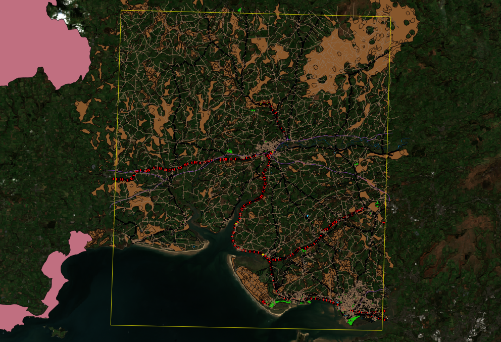

[[Introduction]]
== Introduction

The development of OGC API specifications is not a new activity within the Consortium, as OGC members and staff have been investigating OpenAPI (and its commercial equivalent, Swagger) in a concentrated effort since 2016. This effort was the result of a recognition that although the existing OGC web service standards are in effect web APIs, there are a number approaches adopted by modern web API frameworks that would require a fairly fundamental change in underlying design.

Two documents really provided the initial energy to get serious about redesign: the OGC Open Geospatial APIs White Paper, edited by George Percivall cite:[OGC16_019r4], and the Spatial Data on the Web Best Practices, jointly developed by OGC and the World Wide Web Consortium (W3C) cite:[OGC15_107]. These documents highlighted how geospatial data should be more native to the web. Further, OGC staff were working on “implementer-friendly” views of OGC standards and experimented with an OpenAPI definition for the Web Map Tile Service (WMTS).

But perhaps the most important impact was the leap of the OGC Web Feature Service (WFS) and Filter Encoding Service (FES) Standards Working Group (SWG) that rebuilt the WFS standard with an integrated OpenAPI definition as core to description of how to build against the standard. The work on WFS, which has resulted in the OGC API - Features specification (formerly called WFS 3.0), benefited from a two-day Hackathon held in 2018. Since then, other OGC web service SWGs have begun to independently develop API specifications based on their relevant OGC web service standards.

Numerous discussions occurred at OGC quarterly Technical Committee (TC) Meetings to consider those elements being developed in each SWG which should be common to all web API standards. These discussions came to a head at the February 2019 TC Meeting in Singapore, where a series of working group meetings and common sessions for the whole TC Membership reinforced the desire to work on a common framework for many OGC web standards and to develop a nomenclature for labeling these standards. Thus, the pattern “OGC API [resource]” was coined. The discussions in Singapore also resulted in the planning of the OGC API Hackathon to define and test common elements from Coverages, Map Tiles, and Processing standards work using foundational material from the Features work.

The OGC API Hackathon 2019 was hosted by the Geovation Hub in London, United Kingdom, from June 20th to 21st, 2019. The hackathon was sponsored by the European Space Agency (ESA) and the Ordnance Survey. The goal of the hackathon was to advance the development of OGC API specifications. The output of this hackathon should lead to a solid, common core and advancement of a whole new generation of OGC standards that are flexible in modern IT environments.

=== Overview of the Challenge

The challenge of the Hackathon was to define and test common elements from Coverages, Map Tiles, and Processing standards work using foundational material from the Features work. The magnitude of this challenge was reflected by the fact that the OGC API specifications for Coverages, Map Tiles, and Processing were all at different stages of development. Therefore the Hackathon had to advance the development of all of the specifications to a stage where common elements across all of the specifications could be identified.

=== Scenario

NOTE: This section is a working draft.

To facilitate the development of the OGC API specifications, the scenario presented in this section was provided as a reference for the teams. The scenario is based on flood risk management and is motivated by recents events such as the 2018 floods that affected parts of Europe (including the United Kingdom, Italy, France, Spain and Portugal) cite:[WikipediaEUFloods] and the 2019 floods that affected parts of the United States cite:[WikipediaUSFloods]. The scenario draws from the OGC's Disasters Interoperability Concept Development Study (CDS) which assessed geospatial Web services across the disaster domain, defining the core components of National Spatial Data Infrastructure (SDI) architecture for disasters (Disasters SDI), and defining use cases and scenarios for future implementations as part of a follow-on pilot phase cite:[Idol2018].

Risk mitigation is one of the phases in the ‘life cycle’ of disaster management cite:[Idol2018], which includes the steps shown in <<img_disastermanagementcycle>>. _Mitigation_ refers to taking sustained actions to minimise or completely eliminate the long-term risk from hazards and their effects to individuals and property. _Preparedness_ refers to building the emergency management capabilities to respond effectively to any hazard, as well as to recover from the hazard. _Response_ refers to conducting emergency operations that reduce the hazard to acceptable levels (or eliminate it entirely) in order to save lives, through evacuation of potential victims, and provision of food, water, medical care and shelter to those affected by the disaster. _Recovery_ refers to the rebuilding of communities that have been affected by a disaster so that those communities, as well as their governments, can return to normality and function on their own. A more detailed discussion on disaster management can be found in the OGC Development of Disaster Spatial Data Infrastructures for Disaster Resilience Engineering Report cite:[Idol2018].

[#img_disastermanagementcycle,reftext='{figure-caption} {counter:figure-num}']
.Disaster management cycle
image::images/disastermgmtcycle2.png[width=800,align="center"]

As part of Government flood risk management policy, Local Authorities have to carry out a preliminary flood risk analysis. Using satellite imagery, flood risk data, along with asset information, vulnerable property information and topographic data, Local Authorities carry out analysis to improve resilience and promote a more efficient use of resource.

A Local Authority is tasked with identifying at-risk residential properties in order to assist in flood prevention and amelioration. By carrying out this task, the Local Authority aims to reduce the number of residential properties affected by floods, as well as to decrease the economic and social costs associated with such devastating events. The Geospatial Specialists at the Local Authority embark on the steps presented in <<table_flood_risk_scenario_steps>> in order to carry out the task.

[#table_flood_risk_scenario_steps,reftext='{table-caption} {counter:table-num}']
.Steps in the flood risk management scenario
[cols="2,5,3",width="75%",options="header",align="center"]
|===
|Step | Description | Notes

| 1
| Receive satellite imagery, digital terrain model, Flood Risk Zone, address, and topographic data
|

| 2
| Overlay flood assets such as culverts, levees etc.
|

| 3
| Combine multiple datasets together.
|

| 4
| Data analysis to assess/quantify flood risk.
| A number of hydrology approaches may be applied e.g. run-off modelling

| 5
| Identify at risk properties and possible remediation strategies.
|

| 6
| Execute cost-benefit analysis to determine priorities.
|

| 7
| Commission work for on-the-ground implementation. This may be carried out by internal or external teams.
|

| 8
| Impact of remediation work assessed by external engineering consultant.
|

|===

The illustration in <<img_aoi>> shows the Area of Interest (AOI) that was selected to facilitate prototyping, demonstration and briefings. The AOI covered the region of Carmarthenshire, Wales and focused on the town of Carmarthen. The region was the site of significant flooding in October 2018 and hence provided an appropriate location to based the flood-based scenario adopted for the Hackathon.

[#img_aoi,reftext='{figure-caption} {counter:figure-num}']
.Area-of-Interest (Contains OS data © Crown copyright and database right 2019;  Satellite image: ESA Copyright)

Whereas the Time-Of-Interest (TOI) was October 2018, the AOI had the polygonal bounds in World Geodetic System 1984 (WGS84) coordinates:

[source,txt]
----
-4.09247619415462,51.6507504017036
-4.59606172257991,51.6468710002251
-4.59750580025958,52.0105126182078
-4.09303085864973,52.0127870676365
-4.09247619415462,51.6507504017036
----

=== What was provided

==== Supporting Datasets

The following datasets were identified as relevant to the scenario, and thus recommended for testing implementations of the specifications.

* ESA Sentinel Data: The Sentinels are a family of missions developed by ESA for Corpenicus, the European Union's Earth Observation programme. The data supplied to the OGC API Hackathon included imagery from the Sentinel-2 mission. Launched on 23 June 2015, the Sentinel-2 mission is a polar-orbiting, multispectral high-resolution imaging mission for land monitoring to support emergency services, imagery of vegetation, soil and water cover, inland waterways and coastal areas cite:[ESACopernicus1].  The Sentinel imagery was supplied by Sinergise, the providers of sentinelhub.com cite:[Sinergise2019].
* UK Met Office DataPoint: DataPoint is a freely available service that offers meteorological feeds for use by professionals, the scientific community, and developers. It is an unsupported service, with a primary goal of facilitating research, development and innovation cite:[MetOffice2019].
* UK Met Office Atmospheric Deterministic and Probabilistic Forecasts: This dataset includes atmospheric deterministic and probabilistic forecasts provided as downloadable gridded data cite:[MetOffice2019b]. The data includes 2km deterministic high-resolution atmospheric data for the UK and 10km deterministic high-resolution atmospheric data for the Globe. There is also data from the Global and Regional Ensemble Prediction System.
* Ordnance Survey - OS Open Zoomstack: This dataset provides a single, customisable map of Great Britain to be used at national and local levels. The dataset is available in OGC GeoPackage format. The dataset includes vector data at a variety of scales, from a whole-country view to a street-level view (1:10,000) cite:[OrdnanceSurvey2019z].
* Meteorological Service of Canada Datamart: A variety of raw meteorological data types and forecast data provided by the Meteorological Service of Canada (MSC). It is aimed at specialized users with good meteorological and Information Technology knowledge. The datasets are available through direct download from an HTTP server, as well as through a Web Map Service (WMS) cite:[MSC2019].

==== Supporting Services

The following datasets were identified as relevant to the scenario, and thus recommended for testing implementations of the specifications.

* Meteorological Service of Canada Geospatial web services: This service provides access to the MSC's open data, including raw numerical weather prediction (NWP) model data layers and the weather radar mosaic. The service provides meteorological layers through a Web Map Service (WMS) interface to enable end-users to display meteorological data within their own tools, on interactive web maps and in mobile apps cite:[MSC2019b].
* National Oceanic and Atmospheric Administration (NOAA) National Weather Service Data as OGC Web Services: These web services provide meteorological data covering the United States, through interfaces that conform to the Web Map Service (WMS), Web Feature Service (WFS) and Web Coverage Service (WCS) standards of the OGC cite:[NOAA2019].

==== Deployment Infrastructure

Participants were advised to bring their own laptops to the hackathon. To support testing, the following infrastructure options were available to participants:

* Participants could deploy services into their own computers.
* Participants could deploy services into their own Cloud infrastructure.
* By prior arrangement, participants could deploy services into Ordnance Survey-sponsored Cloud infrastructure.

=== Hackathon Participants

NOTE: This list will be updated at the start of the Hackathon

The Hackathon was sponsored by the European Space Agency (ESA) and the Ordnance Survey.

The following organizations participated in the Hackathon:

* 52°North GmbH
* akouas
* ARC
* Arup
* blockdore
* Board Adviser
* British Antarctic Survey
* Cicy
* CREAF
* CubeWerx Inc.
* Deimos Space UK
* developer
* District Government Cologne - Geobasis NRW
* Defence Science and Technology Laboratory (Dstl)
* Duisburg Essen university
* Ecere Corporation
* ECMWF
* El Toro
* EOS Data Analytics
* EOX IT Services GmbH
* Esri UK
* Eurac Research
* European Space Agency (ESA)
* Geobeyond
* GeoCat B.V.
* GeoLabs
* GeoSeer
* GeoSolutions
* Geovation
* Heazeltech
* Helyx SIS
* Hexagon
* Infinity Corporation Limited
* interactive instruments GmbH
* ISRIC - World Soil Information
* Jet Propulsion Laboratory (JPL)
* JRC, European Commission
* Land Information New Zealand
* Landcare Research, New Zealand
* lat/lon GmbH
* Met Office
* Meteorological Service of Canada
* National Aeronautics and Space Administration (NASA)
* National Geospatial Intelligence Agency (NGA)
* National Land Survey of Finland
* Natural Resources Canada
* NOAA/NWS
* Open Geospatial Consortium
* Ordnance Survey
* OSGeo
* Princeton University
* Princeton University Library
* Quick Caption
* rasdaman GmbH
* Secure Dimensions
* Simms Reeve
* Sinergise
* Solenix
* Spacebel s.a.
* Strategic Alliance Consulting Inc
* University College London
* University of Birmingham
* University of Münster
* University of Notre Dame
* WebGeoDataVore
* West University of Timisoara
