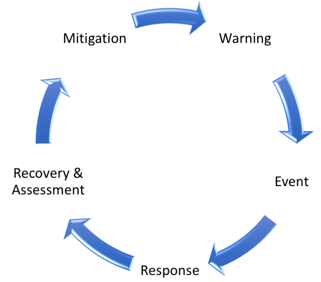

[[Introduction]]
== Introduction

The development of OGC API specifications is not a new activity within the Consortium, as OGC members and staff have been investigating OpenAPI (and its commercial equivalent, Swagger) in a concentrated effort since 2016. This effort was the result of a recognition that although the existing OGC web service standards are in effect web APIs, there are a number approaches adopted by modern web API frameworks that would require a fairly fundamental change in underlying design.

Two documents really provided the initial energy to get serious about redesign: the OGC Open Geospatial APIs White Paper, edited by George Percivall cite:[OGC16_019r4], and the Spatial Data on the Web Best Practices, jointly developed by OGC and the World Wide Web Consortium (W3C) cite:[OGC15_107]. These documents highlighted how geospatial data should be more native to the web. Further, OGC staff were working on “implementer-friendly” views of OGC standards and experimented with an OpenAPI definition for the Web Map Tile Service (WMTS).

But perhaps the most important impact was the leap of the OGC Web Feature Service (WFS) and Filter Encoding Service (FES) Standards Working Group (SWG) that rebuilt the WFS standard with an integrated OpenAPI definition as core to description of how to build against the standard. The work on WFS, which has resulted in the OGC API - Features specification (formerly called WFS 3.0), benefited from a two-day Hackathon held in 2018. Since then, other OGC web service SWGs have begun to independently develop API specifications based on their relevant OGC web service standards.

Numerous discussions occurred at OGC quarterly Technical Committee (TC) Meetings to consider those elements being developed in each SWG which should be common to all web API standards. These discussions came to a head at the February 2019 TC Meeting in Singapore, where a series of working group meetings and common sessions for the whole TC Membership reinforced the desire to work on a common framework for many OGC web standards and to develop a nomenclature for labeling these standards. Thus, the pattern “OGC API [resource]” was coined. The discussions in Singapore also resulted in the planning of the OGC API Hackathon to define and test common elements from Coverages, Map Tiles, and Processing standards work using foundational material from the Features work.

The OGC API Hackathon 2019 was hosted by the Geovation Hub in London, United Kingdom, from June 20th to 21st, 2019. The hackathon was sponsored by the European Space Agency (ESA) and the Ordnance Survey. The goal of the hackathon was to advance the development of OGC API specifications. The output of this hackathon should lead to a solid, common core and advancement of a whole new generation of OGC standards that are flexible in modern IT environments.

=== Overview of the Challenge

The challenge of the Hackathon was to define and test common elements from Coverages, Map Tiles, and Processing standards work using foundational material from the Features work. The magnitude of this challenge was reflected by the fact that the OGC API specifications for Coverages, Map Tiles, and Processing were all at different stages of development. Therefore the Hackathon had to advance the development of all of the specifications to a stage where common elements across all of the specifications could be identified.

=== Scenario

NOTE: This section is a working draft.

To facilitate the development of the OGC API specifications, the scenario presented in this section was provided as a reference for the teams. Risk mitigation is part of the disaster management cycle cite:[GEOAIP2009], which includes the steps shown in <<img_disastermanagementcycle>>.

[#img_disastermanagementcycle,reftext='{figure-caption} {counter:figure-num}']
.Disaster management cycle

As part of Government flood risk management policy, Local Authorities have to carry out a preliminary flood risk analysis. Using satellite imagery, flood risk data, along with asset information, vulnerable property information and topographic data, Local Authorities carry out analysis to improve resilience and promote a more efficient use of resource.

A Local Authority is tasked with identifying at-risk residential properties in order to assist in flood prevention and amelioration. By carrying out this task, the Local Authority aims to reduce the number of residential properties affected by floods, as well as to decrease the economic and social costs associated with such devastating events. The Geospatial Specialists at the Local Authority embark on the steps presented in <<table_flood_risk_scenario_steps>> in order to carry out the task.

[#table_flood_risk_scenario_steps,reftext='{table-caption} {counter:table-num}']
.Steps in the flood risk management scenario
[cols="2,5,3",width="75%",options="header",align="center"]
|===
|Step | Description | Notes

| 1
| Receive satellite imagery, digital terrain model, Flood Risk Zone, address, and topographic data
|

| 2
| Overlay flood assets such as culverts, levees etc.
|

| 3
| Combine multiple datasets together.
|

| 4
| Data analysis to assess/quantify flood risk.
| A number of hydrology approaches may be applied e.g. run-off modelling

| 5
| Identify at risk properties and possible remediation strategies.
|

| 6
| Execute cost-benefit analysis to determine priorities.
|

| 7
| Commission work for on-the-ground implementation. This may be carried out by internal or external teams.
|

| 8
| Impact of remediation work assessed by external engineering consultant.
|

|===

=== What was provided

==== Data and Supporting Services

The following datasets were identified as relevant to the scenario, and thus recommended for testing implementations of the specifications.

* https://sentinel.esa.int/web/sentinel/sentinel-data-access[ESA Sentinel Data]
* https://www.metoffice.gov.uk/datapoint[Met Office DataPoint]
* https://registry.opendata.aws/uk-met-office/[Met Office Gridded Data]
* https://www.ordnancesurvey.co.uk/opendatadownload/products.html[Ordnance Survey - OS Open Zoomstack]
* https://www.ordnancesurvey.co.uk/opendatadownload/products.html[Ordnance Survey - OS Open Greenspace]
* https://dd.weather.gc.ca/[Meteorological Service of Canada Datamart]

==== Deployment Infrastructure

Participants were advised to bring their own laptops to the hackathon. To support testing, the following infrastructure options were available to participants:

* Participants could deploy services into their own computers.
* Participants could deploy services into their own Cloud infrastructure.
* By prior arrangement, participants could deploy services into Ordnance Survey-sponsored Cloud infrastructure.

=== Hackathon Participants

NOTE: This list will be updated at the start of the Hackathon

The Hackathon was sponsored by the European Space Agency (ESA) and the Ordnance Survey.

The following organizations participated in the Hackathon:

* 52°North GmbH
* akouas
* ARC
* Arup
* blockdore
* Board Adviser
* British Antarctic Survey
* Cicy
* CREAF
* CubeWerx Inc.
* Deimos Space UK
* developer
* District Government Cologne - Geobasis NRW
* Defence Science and Technology Laboratory (Dstl)
* Duisburg Essen university
* Ecere Corporation
* ECMWF
* El Toro
* EOS Data Analytics
* EOX IT Services GmbH
* Esri UK
* Eurac Research
* European Space Agency (ESA)
* GEOBEYOND
* GeoCat B.V.
* GeoLabs
* GeoSeer
* GeoSolutions
* Geovation
* Heazeltech
* Helyx SIS
* Hexagon
* Infinity Corporation Limited
* interactive instruments GmbH
* ISRIC - World Soil Information
* Jacobs University
* Jet Propulsion Laboratory (JPL)
* JRC, European Commission
* Land Information New Zealand
* Landcare Research, New Zealand
* Met Office
* Meteorological Service of Canada
* National Aeronautics and Space Administration (NASA)
* National Geospatial Intelligence Agency (NGA)
* National Land Survey of Finland
* Natural Resources Canada
* NOAA/NWS
* Open Geospatial Consortium
* Ordnance Survey
* OSGeo
* Princeton University
* Princeton University Library
* Quick Caption
* Secure Dimensions
* Simms Reeve
* Sinergise
* Solenix
* Strategic Alliance Consulting Inc
* University College London
* University of Birmingham
* University of Münster
* University of Notre Dame
* WebGeoDataVore
* West University of Timisoara
