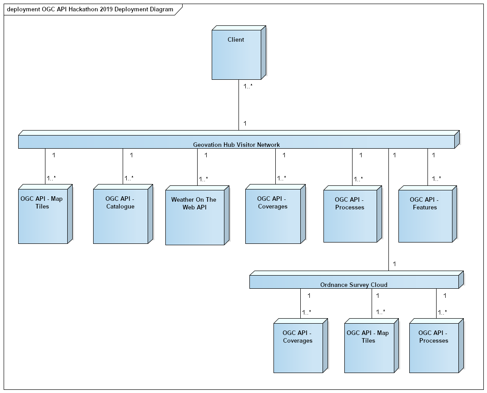

[[Architecture]]
== Architecture

The focus of the hackathon was on development of the OGC API - Common, the OGC API - Features, OGC API – Processes, the OGC API – Coverages and the OGC API – Map Tiles standards. Implementations of these specifications were deployed in the Hackathon infrastructure in order to build a solution with the architecture shown in <<img_architecture>>. As shown on the illustration, the architecture adopted a multi-tier approach that included one or more implementations of each OGC API specification deployed on the wider Internet (e.g. in participants' own Cloud environments), as well as some implementations deployed in the Ordnance Survey's Cloud which is hosted on Microsoft Azure.

[#img_architecture,reftext='{figure-caption} {counter:figure-num}']
.Solution Architecture of the OGC API Hackathon

The OGC API - Common specification documents the set of common practices and shared requirements that have emerged from the development of Resource Oriented Architectures and Web APIs within the OGC. The specification serves as a common foundation upon which all OGC APIs will be built. The OGC API - Processes specification defines how a client application can request the execution of a process, how the inputs to that process can be provided, and how the output from the process is handled. The OGC API - Map Tiles specification defines an OGC standard for a Web Map Tile API that can serve map tiles of spatially referenced data using tile images with predefined content, extent, and resolution. The OGC API - Coverages specification defines a Web API for accessing coverages that are modelled according to the http://docs.opengeospatial.org/is/09-146r6/09-146r6.html[Coverage Implementation Schema (CIS) 1.1]. The hackathon also sought to maintain consistency between the aforementioned specifications and the OGC API - Features specification. The OGC API - Features specification offers the capability to create, modify and query geospatial feature data on the Web.

=== Service Implementations

==== pygeoapi

pygeoapi is a Python server implementation of the emerging OGC API specifications. Early versions of this software implemented the OGC API - Features specification (formerly WFS 3.0). Recent versions of the software have included support for both the OGC API - Features and the OGC API - Processes specifications. Support for these specifications makes it possible publish feature data and geospatial processes. As the name suggests the software is built using the Python programming language and is supported by a developer toolchain that includes Docker and Git/Github.

==== 52°North JavaPS

The 52°North JavaPS product is an open source implementation of both the Web Processing Service (WPS) standard and the OGC API - Processes specification. JavaPS enables the deployment of geospatial processes on the Web in a way that conforms to OGC standards. The software is built using the Java programming language and is supported by a developer toolchain that includes Maven and Git/Github. The software features a pluggable architecture for processes and data encodings that is based on the 52°North https://wiki.52north.org/SensorWeb/Iceland[Iceland] project which represents a generic Java framework for OGC Web Services. By virtue of being based on the Iceland project, JavaPS provides components that are associated with processing geospatial data, for example request objects, response objects, decoders, encoders, parsers.

==== Esri
Esri produce both an installable product (ArcGIS Enterprise) and SaaS product (ArcGIS Online) which support adopted OGC specifications. ArcGIS Enterprise as a server implements WMS, WMTS, WCS2, WPS, WFS2, KML, Geopackage etc as well as other de-facto standards. ArcGIS Online as a server implements WMTS, WFS2 as well as other de-facto standards.
Until the OGC API standards are stable and formally adopted, it is not feasible to implement them in the released products. Therefore for the purposes of the Hackathon and further R&D, Esri have implemented the OGC-API tiles as a facade on to ArcGIS Online tiled services. Technically this is currently implemented as a node.js server running in Microsoft Azure.
https://ogc-tiles-esri-server.azurewebsites.net

==== TBA

TBA

=== Client Implementations

==== OpenSphere OGC API Plugin

OpenSphere is a pluggable, single-page, GIS web application that supports both 2D and 3D views. It supports hooking up to many common servers and formats such as ArcGIS, Geoserver (and other OGC WMS/WFS services), XYZ, TMS, KML, GeoJSON, Shapefiles and CSVs. Other features include animation of both raster and vector data, import and export of various formats, and saving files and layers between sessions. Sigma Bravo extended OpenSphere to support OGC API - Features and OGC API - Map Tiles.

==== Hexagon LuciadLightspeed

LuciadLightspeed provides a foundation for advanced geospatial analytics applications. It allows users to create high performance command & control and location intelligence applications with clean design implementation and rapid application development. A desktop client application was implemented using LuciadLightspeed and configured to interface services implementing the OGC API - Map Tiles specification.

==== Solenix WPS Demo Client

The Solenix WPS Demo client is an adaptation of the OGC Testbed 14 client, accounting for some of the changes introduced with the OGC API - Processing.

The client application runs from a web browser.

==== TBA

TBA

==== TBA

TBA
