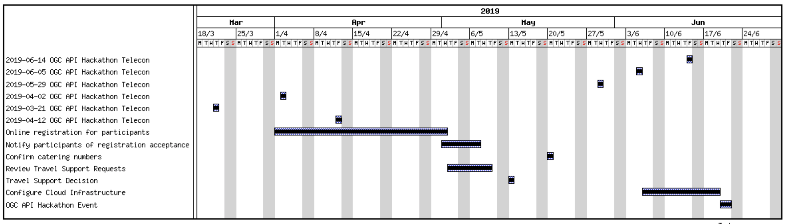
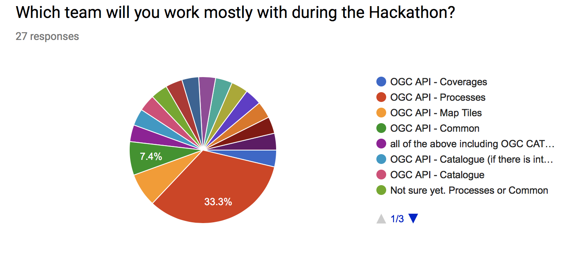
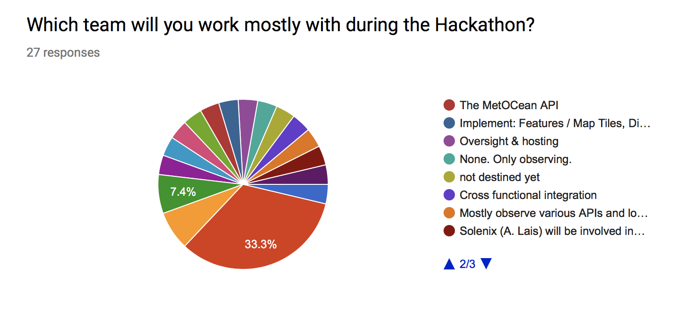
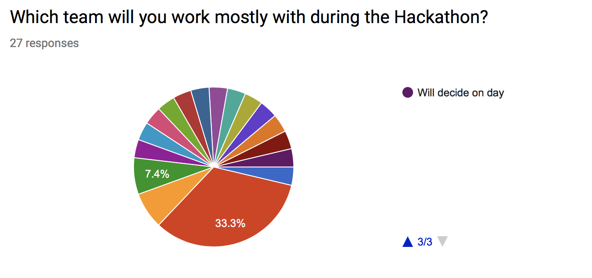

[[KeyFindings]]
== Key Findings

This section presents the key findings from the Hackathon.

=== Results

==== OGC API - Processes

The participants made an observation that some attributes for referenceValue were missing. As a result, changes were made to add attributes for identifying the MIME type, schema and encoding in a referenceValue object. These changes were needed for providing input in a specific format or returning output in a specific format.

There was a https://github.com/opengeospatial/wps-rest-binding/issues/42[suggestion] to add ows:additionalProperties and ows:context to metadata. It was observed that ows:additionalParameters allows a service to provide key value pairs metadata information. It was also observed that Testbed 13 and testbed 14 had demonstrated the utility of such a capability. As a result, the hackathon participants committed changes to the OGC API - Process specification adding the definition of additionalParameters.

There was also a https://github.com/opengeospatial/wps-rest-binding/issues/37[discussion] about whether process output arrays are fully supported. The participants observed that currently the http://www.opengis.net/spec/WPS/2.0/req/conceptual-model/process/output-value-cardinality[output-value-cardinality] requirement limits cardinality of the output to one. A number of workarounds were suggested including returning a list of outputs, returning an archive (zip), returning a Metalink, or returning Multipart/mixed responses. The participants concluded that a solution would need to handle all kind of outputs, including outputs by reference, as well as binary files.

There was a https://github.com/opengeospatial/wps-rest-binding/issues/30[discussion] about how to specify synchronous execution OGC API Hackathon. The options identified included i) Either use a query parameter or a HTTP header to specify the execution mode, ii) Return a result object, iii)  Do not return a header with the location (as there technically is no location, i.e. its a temp. This issue was also related to the broader issue of how to choose between synchronous and asynchronous mode for job creation. The participants observed that indeed the WPS 2.0 specification has a jobID in the the status object, and therefore the OGC API - Processes specification should also include a jobID into the statusInfo object.

There was a https://github.com/opengeospatial/wps-rest-binding/issues/31[suggestion] for an extension supporting triggers according to job status. In particular the suggestion was for the user/client to be able to specify triggers for conditions like: `onSuccess` a Url to be triggered upon process completion, or `onFail` a URL to be triggered on process failure, `progressUpdate` a URL to be triggered by the job while progressing and should contain progress status (eg. proccent of job completion). Participants considered whether such a capability might be more appropriate as an extension, perhaps associated with a pub/sub notification capability.

There was a https://github.com/opengeospatial/wps-rest-binding/issues/32[suggestion] to add the exception information to the status information at GET `/processes/{id}/jobs/{jobID}` and remove the GET `/processes/{id}/jobs/{jobID}/exception` endpoint. The participants considered whether an HTTP 201 code should be returned with POST /processes/{id}/jobs. The participants resolved that allowing for plural form results could address this issue, for example `processes/{processId}/jobs/{jobId}/results/{resultId}`. Use of an HTTP 201 code was however inconclusive.

==== OGC API - Map Tiles

The participants identified three roots for API building blocks, namely the root of the service, collection ID, and collection ID combined the coverage ID. A need to combine these root paths with maps and tiles was identified. There was an observation made that if the roots are combined with maps and tiles, there is an opportunity to provide much more information through data tiles such as vector tiles or coverage tiles. There was also an observation made that if a style and style id are concatenated with the path then the API would be able to combine data tiles with portrayals of the information. There was a third alternative identified, which is the concatenation of both the aforementioned approaches.

These paths have specific query parameters associated with them. Participants observed that such a capability may not be fully supported by OpenAPI 3.0.

There was a discussion about whether the response for maps should return raster or vector maps. Related to this was whether a map was at the same level as a collection. There was agreement that maps are not at the same level as collections.

There was a https://github.com/opengeospatial/OGC-API-Map-Tiles/issues/12[suggestion] to normalize the case used by attributes of the tileMatrix construct. Before the hackathon some of the attribute names where in UpperCamelCase whereas others were in lowerCamelCase. Normalizing the attribute names would ensure consistency of naming and thus make it easier for developers to implement.

There was also an https://github.com/opengeospatial/OGC-API-Map-Tiles/issues/13[observation] made that there is a need to determine where metadata fields supported by WMS could be applied in the OGC API - Map Tiles standard. The metadata fields supported by the WMS standard include: Name, Title, Abstract, KeywordList, Style, CRS, EX_GeographicBoundingBox, BoundingBox, Dimension, Attribution, AuthorityURL, Identifier, MetadataURL, DataURL, FeatureListURL, MinScaleDenominator, MaxScaleDenominator, queryable, cascaded, opaque, noSubsets, fixedWidth, and fixedHeight.

The participants https://github.com/opengeospatial/OGC-API-Map-Tiles/issues/14[observed] that the extents and bounding box classes used by the OGC API - Map Tiles specification have been defined in different ways. The extent class defines a bounding extent as an array of numbers indicating  bounding coordinates, whereas the boundingBox class defines the bounding coordinates as separate attributes for the lower and upper corner coordinates.

==== OGC API - Coverages

The participants agreed that OGC API - Coverages should inherit from OGC API - Common as much as possible. This meant that wherever a requirement is specified in OGC API - Common, if it is relevant to coverages, the OGC API - Coverages specification would reference the requirement in the OGC API - Common specification.

The participants agreed that a request for the coverages path would return a list of all  of the coverage identifiers included in the collection.

There was also agreement that a request for the coverage description would only return the essential information instead of the complete metadata associated with the coverage.

There was discussion about how to support bounding box (BBOX) filters on multidimensional coverages. The participants expressed the need to inherit the BBOX and time parameters from OGC API - Common, however also they also observed that there would be a need to identify a CRS for height. One of the suggestions was for each axis to have a separate coverage filter. The participants concluded that there is currently no construct in the Core part of the OGC API - Common specification that supports filtering of coverages.

The was discussion about the retrieval of coverages. The OGC API - Coverages specification was updated to allow for different ways for getting the coverages individually. Since not every format is suitable for transferring all of the coverage information, participants identified different ways for getting the different types of coverages. It was also noted that for applications that do not want to use collections, they can just use the `coverages/{coverageid}` path.

There was a discussion about whether parameters, values and URL bases were case sensitive. This issue was observed to be applicable to all of the specifications. There was a suggestion that the OGC API - Common specification should specify a rule for case sensitivity and that that rule should be consistent with the RFC.

==== OGC API - Common

There was a discussion about whether OGC API - Common should support the CRS:84 coordinate system (WGS84) by default. The participants observed that the collectionInfo metadata (returned for each collection) allows one to specify the CRS supported by the collection. The client can specify one of the other CRS if they do not support the default. For coverages, the default CRS was observed to be the native CRS. The participants concluded that there will be a default CRS for the API and the OGC API - Common specification should have complete control over the CRS and the default CRS should not constrain the resource.

The participants discussed what role version numbers would play within an OGC API, recognising that the current suite of OGC web service standards require implementations to indicate the supported versions as a query parameter. The participants determined that the version of the standard would be reflected in the conformance class. Each conformance class would be made uniquely identifiable and any change to that conformance class would relate in the creation of a new conformance class. It would therefore not be necessary to indicate the version on the standard on the path or the query parameters of an implementation of the OGC APIs.

The participants observed that there is a need for something like CRS:84 that has ellipsoid height. EPSG:4327 was suggested as a possible basis for such a CRS, with the caveat that it has been deprecated. It was agreed to discuss the issue of a height or elevation CRS with the WFS SWG and the CRS DWG at the OGC TC meeting in Leuven.

==== Technology Integration Experiments (TIE)

The following table presents Technology Integration Experiments (TIE) that were completed during the Hackathon.

[#table_ties,reftext='{table-caption} {counter:table-num}']
.Technology Integration Experiments (TIE) for OGC APIs
[cols=",,,,,,,",width="100%",options="header",align="center"]
|===
|Services\Client | Hexagon | Helyx | SigmaBravo | Esri | Solenix | EURAC | Sinergise

|52 North |  | Processes  | | | Processes | |

|CubeWerx |  | Processes |  | | Processes | |

|Esri | Map Tiles |   | Map Tiles | Map Tiles | | |

|Helyx |  | Processes  |  | | | |

|pygeoapi |  |  | Features | | Processes | |

|Geoserver |  |   | Features | | | |

|Spacebel |  |   | Features, Catalogue | | Processes | |

|West University of Timisoara | | | | | Processes | |

|rasdaman | | | | | | Coverages | Coverages

|===

NOTE: Services on rows and Clients on columns

=== What occurred

==== Processes

The decision to hold the OGC API Hackathon was made by the TC at the 2019 TC meeting in Singapore. Following this decision, OGC staff engaged a number of potential sponsors from the OGC membership. Having identified sponsors and hosts, a series of teleconferences were held for planning the event. These teleconferences discussed venue logistics, computing infrastructure, data, scenarios, catering and other topics. A Gantt chart of the planning and execution of the hackathon is shown in <<img_gantt>>.

[#img_gantt,reftext='{figure-caption} {counter:figure-num}']
.A Gantt chart of the planning and execution of the hackathon

During the hackathon, the process involved alternation between briefings, discussions and coding. On the first day of the hackathon, three back-briefs were held, that is one in the morning, another in the afternoon and another in the evening. These briefings provided an opportunity for issues to be discussed across teams. Agreements and resolutions from the discussions triggered by the briefings were then fed back into the team-specific work.

==== Organization

By the event date, 76 individuals had been registered to participate in-person and 35 participants had been registered to participate remotely. A questionnaire sent out just before the hackathon to collect information about which OGC API specifications participants would focus on received 27 responses, with the spread of interest as showin in <<img_interests_1>>, <<img_interests_2>> and <<img_interests_3>>.

[#img_interests_1,reftext='{figure-caption} {counter:figure-num}']
.Participants' interests (1 of 3)

[#img_interests_2,reftext='{figure-caption} {counter:figure-num}']
.Participants' interests (2 of 3)

[#img_interests_3,reftext='{figure-caption} {counter:figure-num}']
.Participants' interests (3 of 3)

The hackathon was therefore organized around teams based on the OGC API specifications. Participants interested in APIs other than those for coverages, processes, and map tiles, were asked to contribute to the work on advancing the OGC API - Common specification. This would help ensure that the OGC API - Common specification provides an appropriate a base for all future OGC APIs.

==== Technology

The client and service applications were bound together through interfaces conforming to the OGC APIs for Map Tiles, Processes, Features, Catalogues, and Coverages. The client applications included software from Hexagon, Helyx, OpenSphere, Esri, Solenix, EURAC and Sinergise. The service applications included software from  52 North, CubeWerx, Esri, Helyx, pygeoapi, Geoserver, Spacebel, West University of Timisoara, and rasdaman. The variety of software implementations suggests that the OGC API specifications widely implementable and do not depend on any single vendor’s technology.

The deployed technologies includes software implemented in Python, Java, and NodeJS. Some of the deployed technologies includes Python adapters to software implemented in C++. This variety of programming languages shows that the OGC API specifications are independent of any programming language.

==== Information

=== Experiences

TBA

=== Lessons learnt

TBA

=== What are the next steps?

TBA
